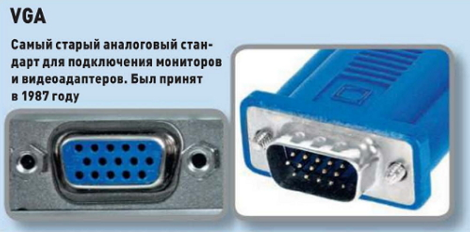
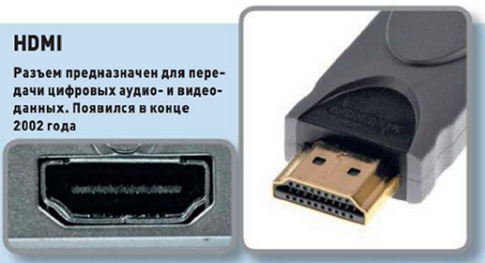
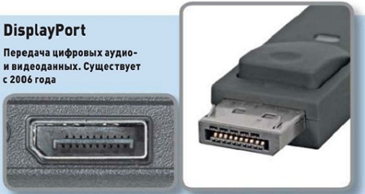

# Основные характеристики мониторов
# 1. Размер экрана монитора
В мониторах и телевизорах размер экрана измеряется в дюймах
1 дюйм=2,54 см
# 2. Широкоформатные мониторы
- Соотношение сторон 16:10
 
  Прямоугольные Более современные

- Соотношение сторон 4:3

  Квадратные Более старые

# 3. Разрешение экрана. 
### Весь экран ЖК монитора разбит на маленькие точки (которые называют пикселями или зернами), из которых и складывается изображение. Естественно, чем меньше размер каждой точки, тем качественнее будет изображение.
### Разрешение – это количество пикселей, которые отображаются монитором по вертикали и горизонтали.
Для 19-дюймовых мониторов не должно составлять менее 1280×960 точек, для 22-дюймовых – не менее 1600×1050 точек, размер точки должен составлять не более 0,3 мм, а размер точки менее 0,278 мм является очень хорошим показателем.
# 4. Время отклика матрицы
**Время отклика матрицы** – это минимальное время, за которое один кадр может смениться другим.
- Чем меньше время отклика – тем лучше (и, соответственно, монитор дороже)
- Если это время будет слишком большим, то изображение будет смазываться (так как монитор не будет успевать менять картинки).
- Для игрового компьютера предпочтительнее выбрать монитор со временем отклика 2мс.
# 5. Разъемы подключения монитора
# VGA

#
# DVI

#
# HDMI

#
# Display Port

Интерфейсы HDMI и DisplayPort позволяют передавать на монитор не только видеоданные, но и аудио.
#
# 6. Яркость и контрастность
Яркость монитора показывает количество света, излучаемого полностью белым экраном монитора. Контрастность определяют как соотношение яркости самых светлых и самых темных участков. 

Лучше выбирать монитор с яркостью от 250 до 400 кд/м2 (канделл на метр квадратный), при этом контрастность не должна быть меньше 500:1. Оптимальная контрастность лежит в диапазоне 700:1 до 1000:1.
# 7. Углы обзора монитора
Оптимально выбирать монитор с углом обзора не менее 160 градусов по вертикали и горизонтали 

это современный стандарт для качественного изображения без искажения цветов и контрастности.
