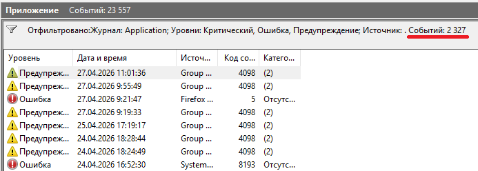
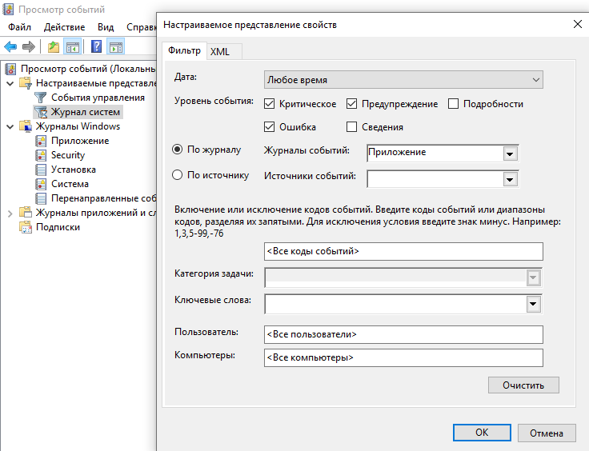
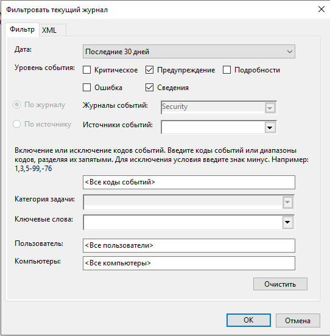

# Лабораторная работа №19
# Работа с журналами событий Windows 
# Цель:  Изучить принцип работы журналов событий ОС Windows 
## Теоретические сведения:

### Даже когда пользователь ПК не совершает никаких действий, операционная система продолжает считывать и записывать множество данных. Наиболее важные события отслеживаются и автоматически записываются в особый лог, который в Windows называется Журналом событий. Но для чего нужен такой мониторинг? Ни для кого не является секретом, что в работе операционной системы и установленных программ могут возникать сбои. Чтобы администраторы могли находить причины таких ошибок, система должна их регистрировать, что собственно она и делает. 

### Итак, основным предназначением Журнала событий в Windows 7/10 является сбор данных, которые могут пригодиться при устранении неисправностей в работе системы, программного обеспечения и оборудования. Впрочем, заносятся в него не только ошибки, но также и предупреждения, и вполне удачные операции, например, установка новой программы или подключение к сети. 

### Физически Журнал событий представляет собой набор файлов в формате EVTX, хранящихся в системной папке %SystemRoot%/System32/Winevt/Logs. 

### Хотя эти файлы содержат текстовые данные, открыть их Блокнотом или другим текстовым редактором не получится, поскольку они имеют бинарный формат. Тогда как посмотреть Журнал событий в Windows 7/10, спросите вы? Очень просто, для этого в системе предусмотрена специальная штатная утилита eventvwr.

# Задание на лабораторную работу:
# №4 Установленный фильтр 

 

# №5 Сохраненый фильтр

 

# №6 Настройки фильтра для Security

 

# №7 Привязка задачи к событию

|Ваш № ПК|ID события|
|-|-|
|ПК №1|2|
|ПК №2|4|
|ПК №3|8|
|ПК №4|10|
|ПК №6|1|
|ПК №7|3|
|ПК №9|5|

# Контрольные вопросы 

## 1. 
Это системные файлы (базы данных), в которых Windows автоматически регистрирует все значимые действия в системе.  
- Назначение: диагностика ошибок, аудит безопасности и контроль состояния оборудования.  
- Содержание: каждое событие имеет уникальный ID, дату, время, источник и описание.
## 2.
В современных версиях Windows (10, 11, Server) файлы журналов хранятся здесь:
- Путь: C:\Windows\System32\winevt\Logs
- Формат файлов: .evtx (бинарный XML).
## 3.

Журналы делятся на две большие группы:

**Основные** (Windows Logs)  

**Стандартные категории**, присутствующие во всех системах:
- Приложение (Application): ошибки и уведомления от программ.
- Безопасность (Security): попытки входа, доступ к файлам (результаты аудита).
- Установка (Setup): события при обновлении ОС и установке компонентов.
- Система (System): сообщения от драйверов и системных служб.
Пересылаемые события (Forwarded Events): данные, собранные с других компьютеров сети.

**Дополнительные** (Applications and Services Logs)
Более узкие и специфические категории:  

- Журналы оборудования: события от физических устройств.
- Microsoft: детальные логи конкретных служб (например, PowerShell, Windows Defender).
- События приложений: журналы, которые разработчики создают отдельно от системных.