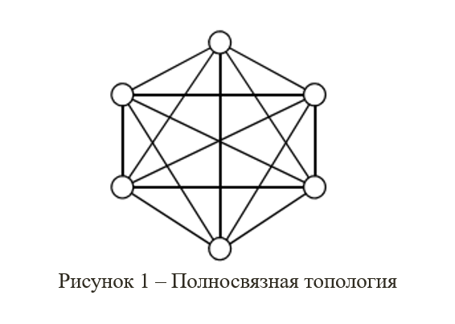
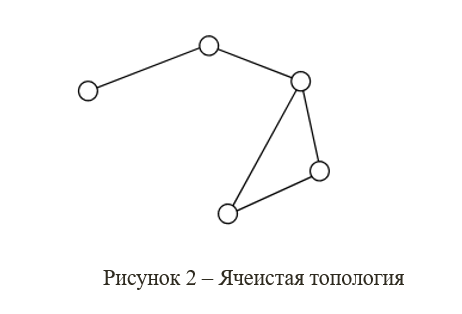
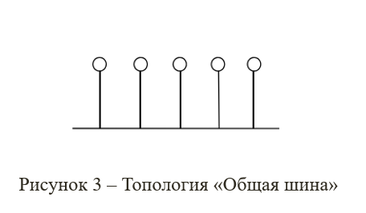
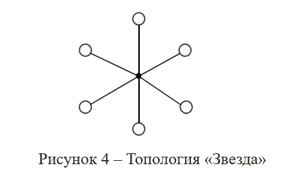
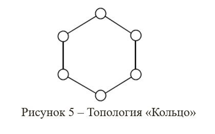
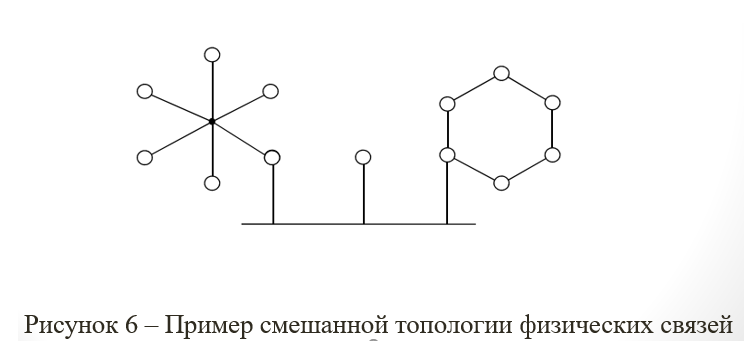
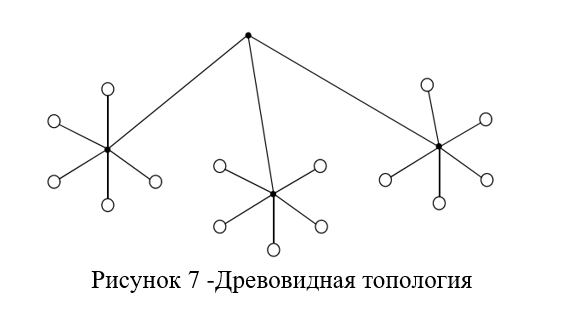

# Топология физических связей
### Под топологией вычислительной сети понимается конфигурация графа, вершинам которого соответствуют компьютеры сети (иногда и другое оборудование, например концентраторы),  а ребрам – физические связи между ними. Компьютеры, подключенные к сети, часто называют станциями или узлами сети.
#
# Полносвязная топология
 Полносвязная топология соответствует сети, в которой каждый компьютер связан с каждым компьютером сети. Несмотря на логическую простоту, этот вариант оказывается громоздким и неэффективным.

#
# Ячеистая топология
Ячеистая топология (англ. Mesh Topology) может быть получена из полносвязной путем удаления некоторых избыточных связей
- Ячеистая топология допускает соединение большого количества компьютеров и характерна для глобальных сетей.

#
# Топология «общая шина»
Общая шина образуется при подключении всех компьютеров сети к единому каналу передачи данных и до недавнего времени была самой распространенной топологией локальных сетей. 
- Основными преимуществами такой схемы являются дешевизна и простота разводки кабеля по помещениям.
- Самый серьезный недостаток общей шины заключается в ее низкой надежности: любой дефект кабеля или какого-нибудь из многочисленных разъемов подключения полностью парализует всю сеть.

#
# Топология «звезда»
Топология звезда образована подключением каждого из компьютеров к общему устройству, называемому концентратором или коммутатором, при помощи отдельного кабеля. 
- В функции концентратора (коммутатора) входит направление передаваемой компьютером информации одному или всем остальным компьютерам сети.

#
# Топология «кольцо»
В сетях с кольцевой топологией данные передаются по кольцу от одного компьютера к другому, как правило, в одном направлении.

Если компьютер распознает данные как «свои», то он копирует их себе во внутренний буфер. 
- Кольцо представляет собой очень удобную конфигурацию для организации обратной связи – данные, сделав полный оборот, возвращаются к узлу-источнику.

#
# Составные топологии
При построении сетей, более сложных, чем сети отделов, используются так называемые составные (смешанные) топологии связей. 

Возможно использование практически любой составной топологии, полученной на основе рассмотренных базовых технологий. 

#
# Древовидная топология
В локальных сетях древовидная топология реализуется иерархической структурой на основе концентраторов или коммутаторов. 

**Корню графа** соответствует корневой концентратор (коммутатор). 

К корневому концентратору непосредственно подключаются концентраторы этажей (отделов), к которым подключены конечные пользователи сети. Серверы предприятия располагаются как можно ближе к корню графа, а серверы отделов – к концентраторам отделов.

#
