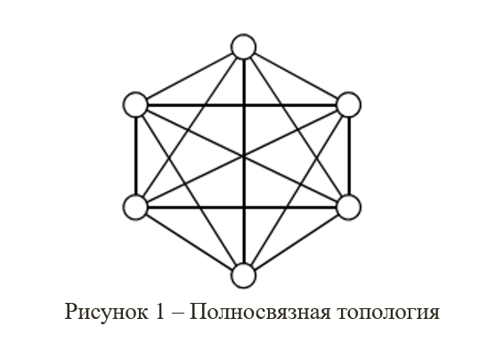
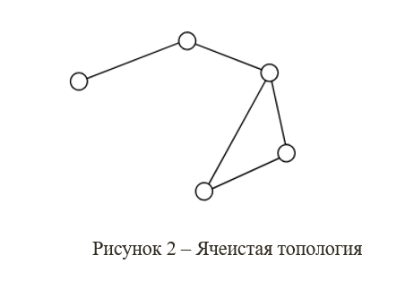
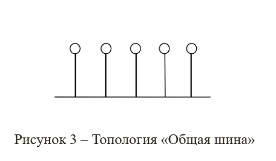
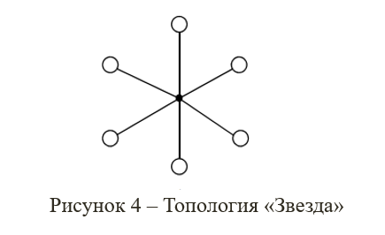
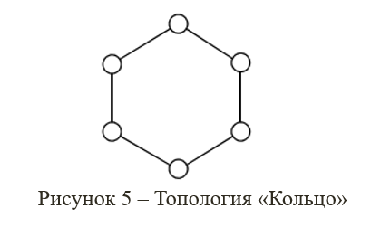
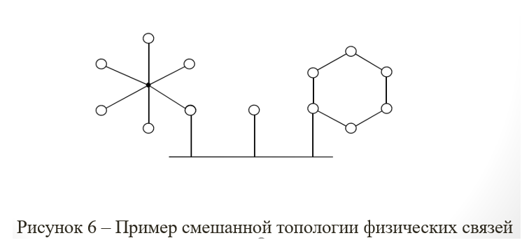
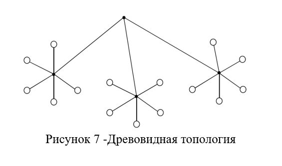

# Топология физических связей
### Под топологией вычислительной сети понимается конфигурация графа, вершинам которого соответствуют компьютеры сети (иногда и другое оборудование, например концентраторы),  а ребрам – физические связи между ними. Компьютеры, подключенные к сети, часто называют станциями или узлами сети.
#
# Полносвязная топология
 Полносвязная топология соответствует сети, в которой каждый компьютер связан с каждым компьютером сети. Несмотря на логическую простоту, этот вариант оказывается громоздким и неэффективным.

#
# Ячеистая топология
Ячеистая топология (англ. Mesh Topology) может быть получена из полносвязной путем удаления некоторых избыточных связей
- Ячеистая топология допускает соединение большого количества компьютеров и характерна для глобальных сетей.

#
# Топология «общая шина»
Общая шина образуется при подключении всех компьютеров сети к единому каналу передачи данных и до недавнего времени была самой распространенной топологией локальных сетей. 
- Основными преимуществами такой схемы являются дешевизна и простота разводки кабеля по помещениям.
- Самый серьезный недостаток общей шины заключается в ее низкой надежности: любой дефект кабеля или какого-нибудь из многочисленных разъемов подключения полностью парализует всю сеть.

#
# Топология «звезда»
Топология звезда образована подключением каждого из компьютеров к общему устройству, называемому концентратором или коммутатором, при помощи отдельного кабеля. 
- В функции концентратора (коммутатора) входит направление передаваемой компьютером информации одному или всем остальным компьютерам сети.

#
# Топология «кольцо»
В сетях с кольцевой топологией данные передаются по кольцу от одного компьютера к другому, как правило, в одном направлении.

Если компьютер распознает данные как «свои», то он копирует их себе во внутренний буфер. 
- Кольцо представляет собой очень удобную конфигурацию для организации обратной связи – данные, сделав полный оборот, возвращаются к узлу-источнику.

#
# Составные топологии
При построении сетей, более сложных, чем сети отделов, используются так называемые составные (смешанные) топологии связей. 

Возможно использование практически любой составной топологии, полученной на основе рассмотренных базовых технологий. 

#
# Древовидная топология
В локальных сетях древовидная топология реализуется иерархической структурой на основе концентраторов или коммутаторов. 

**Корню графа** соответствует корневой концентратор (коммутатор). 

К корневому концентратору непосредственно подключаются концентраторы этажей (отделов), к которым подключены конечные пользователи сети. Серверы предприятия располагаются как можно ближе к корню графа, а серверы отделов – к концентраторам отделов.

#
## 1. История развития компьютерных сетей

Эволюция сетей прошла путь от "компьютер-монстр" до глобальной паутины.

*   1940-1950-е: Эра мэйнфреймов.
    *   Компьютеры огромны, дороги, занимают целые здания.
    *   Режим работы: пакетная обработка. Пользователь приносил перфокарты/ленты с заданием и получал результат через несколько часов. Интерактивной работы не было.
*   1960-е: Многотерминальные системы.
    *   Процессоры дешевеют, появляется концепция разделения времени.
    *   Один мощный компьютер (мэйнфрейм) соединяется с множеством "глупых" терминалов (монитор+клавиатура) через телефонные линии с помощью модемов. Это первые ростки глобальных связей.
*   1970-е: Появление глобальных сетей и мини-ЭВМ.
    *   Связи становятся не только "терминал-компьютер", но и "компьютер-компьютер".
    *   Появляются первые сетевые службы: электронная почта, передача файлов.
    *   Создание мини-ЭВМ (благодаря интегральным схемам). Они дешевле мэйнфреймов, их много. Возникает необходимость объединять их внутри одного предприятия.
*   1980-е: Золотой век стандартизации.
    *   Появление персональных компьютеров (ПК) дало мощный толчок развитию сетей.
    *   Рождение стандартных технологий: Ethernet, Token Ring, Arcnet. Это сделало построение сетей предсказуемым и доступным. Купил адаптеры, кабель, разъемы — получил сеть.
*   1990-е - настоящее время: Интернет и конвергенция.
    *   Глобальные сети (WAN) становятся высокоскоростными, стирается грань между локальными и глобальными сетями.
    *   Доминирование стека протоколов TCP/IP и Интернета.

## 2. Сети как распределенные системы

Компьютерные сети — это вид распределенных вычислительных систем, где несколько центров обработки данных работают совместно.

Сравнение типов распределенных систем:

| Признак | Мультипроцессор | Многомашинный комплекс (МВК) | Компьютерная сеть |
| :--- | :--- | :--- | :--- |
| Элементы | Процессоры | Компьютеры | Компьютеры |
| Связь | Общая шина, общая память | Высокоскоростной канал (адаптеры) | Сетевые адаптеры, каналы связи |
| Управление | Единая ОС для всех процессоров | Специальное ПО для распределения задач | Каждый компьютер под управлением своей ОС |
| Степень связи | Максимальная | Средняя | Минимальная (автономность) |

## 3. Классификация сетей

Сети классифицируют по разным признакам. Важно понимать иерархию.

### По территориальному признаку (масштабу)
1.  LAN (Local Area Network) — Локальные сети:
    *   Радиус до 1-2 км. Высокая скорость передачи.
    *   Назначение: объединение компьютеров в одном здании или офисе.
2.  MAN (Metropolitan Area Network) — Городские сети:
    *   Связывают несколько LAN в пределах города.
    *   Пример: сети кабельного телевидения, городские Wi-Fi сети.
3.  WAN (Wide Area Network) — Глобальные сети:
    *   Огромная территория (страны, континенты).
    *   Скорость ниже, чем в LAN, задержки больше. Используют сложное телекоммуникационное оборудование.
### По масштабам предприятия
1.  Сети отделов:
    *   До 100-150 пользователей. Одна цель, простые ресурсы (принтер, общая папка).
2.  Сети кампусов (Campus Area Network):
    *   Объединение сетей отделов в пределах одного здания или территории (площадью в несколько км²).
    *   Сотни компьютеров. Используется сложное активное оборудование (коммутаторы, маршрутизаторы).
3.  Корпоративные сети (Enterprise Network):
    *   Масштаб целой корпорации с филиалами в разных городах и странах.
    *   Используют все виды связи, включая глобальные каналы (Internet VPN, выделенные линии).

## 4. Топология сети

Топология — это геометрическая схема соединений узлов сети. От нее зависит надежность, стоимость и производительность.

| Топология | Описание | Плюсы | Минусы | Применение |
| :--- | :--- | :--- | :--- | :--- |
| Полносвязная | Каждый узел связан с каждым напрямую. | Максимальная отказоустойчивость. | Огромный расход кабеля, сложность масштабирования. | Только для очень малых сетей (2-4 устройства) или магистральных участков. |
| Ячеистая (Mesh) | Есть связи только между активно общающимися узлами. Остальной трафик идет транзитом. | Баланс между надежностью и стоимостью. | Сложная маршрутизация. | Глобальные сети (WAN), Интернет. |
| Общая шина (Bus) | Все устройства подключены к одному кабелю. | Очень простая и дешевая прокладка. | Низкая надежность (обрыв кабеля — вся сеть падает), сложно искать обрыв. | Устарела. В современных сетях не используется. |
| Звезда (Star) | Каждое устройство подключается отдельным кабелем к центральному устройству (коммутатору/хабу). | САМАЯ ПОПУЛЯРНАЯ. Легко искать неисправности, надежно (проблемы с одним кабелем не влияют на других), легко добавлять новые узлы. | Зависимость от центрального узла (если он выйдет из строя, сеть падает). Расход кабеля выше, чем у шины. | Абсолютное большинство современных локальных сетей. |
| Кольцо (Ring) | Данные передаются по кругу от узла к узлу. Часто используется маркерный доступ. | Удобна для организации обратной связи, детерминированность. | Выход из строя одного узла или обрыв кабеля может парализовать всю сеть (в простом кольце). | Устаревает, использовалась в технологиях Token Ring, FDDI. |
| Древовидная (Tree) | Иерархическая структура, по сути, несколько "звезд", соединенных между собой. | Масштабируемость, возможность структурировать большую сеть. | Сложность настройки, зависимость от узлов верхнего уровня. | Крупные сети кампусов и предприятий. |

## 5. Физическая среда передачи

Это "физика", по которой бегут сигналы.

### Проводные линии
1.  Проводные (воздушные): Просто голые провода. Используются для телефонии, но не для сетей из-за ужасной помехозащищенности.
2.  Коаксиальный кабель:
    *   Конструкция: Центральная жила -> изоляция -> оплетка (экран) -> внешняя изоляция.
    *   Хорошо защищен от помех. Использовался в ранних Ethernet (толстый и тонкий коаксиал). Сейчас вытеснен витой парой и оптикой.
3.  Витая пара (Twisted Pair):
    *   Конструкция: несколько пар скрученных медных проводов. Скрутка снижает влияние помех (перекрестных наводок).
    *   Типы:
        *   UTP (Unshielded) — неэкранированная. Самая популярная для офисов и дома.
        *   STP (Shielded) — экранированная (есть общий экран или экран для каждой пары). Для промышленных зон с высокими помехами.
    *   Категории (Cat): Чем выше категория, тем выше частота и скорость.
        *   Cat5e — 100 Мбит/с / 1 Гбит/с (до 100 м). Стандарт для дома.
        *   Cat6 / Cat6a — 1 Гбит/с / 10 Гбит/с. Для более скоростных сетей.
    *   Разъем: RJ-45.
4.  Волоконно-оптический кабель:
    *   Конструкция: Стеклянная/пластиковая жила, по которой распространяется свет.
    *   Одномодовое (SMF): Тонкая жила, один луч света. Для очень больших расстояний (до 100+ км) и скорости (до 100 Тбит/с).
*   Многомодовое (MMF): Жирная жила, много лучей. Для средних дистанций (до 2 км) и высоких скоростей (до 100 Гбит/с).
    *   *Плюсы:* Нечувствительность к электромагнитным помехам, безопасность (перехватить свет сложно), огромная скорость.

### Беспроводная среда
*   Радиоканалы (Wi-Fi): Стандарты IEEE 802.11 (a/b/g/n/ac/ax). Работают в диапазонах 2.4 ГГц и 5 ГГц.
*   Спутниковая связь: Используется там, где нет другой связи. Большие задержки.
*   Инфракрасное излучение: Требует прямой видимости (пульты ДУ, устаревшие IrDA-порты).

## 6. Активное и пассивное сетевое оборудование

### Пассивное оборудование
Это "коробки" и "провода", которые не требуют питания.
*   Кабель, розетки, патч-панели.
*   Кабель-каналы, лотки, монтажные шкафы (стойки), гофротрубы.

### Активное оборудование
Это устройства, которые требуют питания и обрабатывают сигнал. Перечислю в порядке возрастания "интеллектуальности":

1.  Повторитель (Repeater): Просто усиливает сигнал, чтобы пройти большее расстояние. Работает на физическом уровне. Почти не используется.
2.  Концентратор (Hub): Многопортовый повторитель. Сигнал, пришедший на один порт, тупо повторяется на всех остальных. Это приводит к коллизиям и неэффективному использованию пропускной способности. Устарел.
3.  Мост (Bridge): Делит сеть на сегменты. Анализирует MAC-адреса (канальный уровень) и пропускает трафик только в нужный сегмент. Может соединять сети с разной физической средой (например, витую пару и оптику).
4.  Коммутатор (Switch): Это "интеллектуальный" многопортовый мост. Он запоминает, на каком порту какой MAC-адрес находится, и отправляет пакет строго на нужный порт, не засоряя остальные. Основа любой современной ЛВС.
    *   Управляемые коммутаторы позволяют настраивать VLAN, QoS, зеркалирование портов.
5.  Маршрутизатор (Router): Устройство сетевого уровня (IP). Соединяет разные сети (например, вашу домашнюю сеть с Интернетом). Принимает решение о маршруте передачи пакета на основе IP-адреса и таблиц маршрутизации. Может выполнять функции NAT, Firewall.
6.  Точка доступа (Access Point, AP): Служит мостом между проводной сетью (Ethernet) и беспроводной (Wi-Fi).
7.  Медиаконвертер: Преобразует среду передачи, например, из витой пары в оптику.
8.  Межсетевой экран (Firewall): Фильтрует трафик на основе заданных правил безопасности. Может быть программным и аппаратным. Защищает сеть от вторжений.

## 7. Модель OSI и стек протоколов

### Модель OSI (Open Systems Interconnection)
Это эталонная модель, "путеводитель" по сетям. Понимание ее уровней — база для любого сетевого инженера.

| Уровень (Снизу вверх) | Название (рус/eng) | Единица данных | Что делает? | Примеры протоколов |
| :---: | :--- | :---: | :--- | :--- |
| 7 | Прикладной (Application) | Данные | Интерфейс между сетью и приложением пользователя. | HTTP, FTP, SMTP, DNS, Telnet |
| 6 | Представительский (Presentation) | Данные | Преобразование форматов, шифрование, сжатие. | SSL/TLS, JPEG, ASCII -> EBCDIC |
| 5 | Сеансовый (Session) | Данные | Управление диалогом: установка, поддержка и завершение сеанса связи. | NetBIOS, RPC |
| 4 | Транспортный (Transport) | Сегменты / Датаграммы | Обеспечение надежной доставки (контроль ошибок, повторная передача, управление потоком). | TCP (надежный), UDP (быстрый) |
| 3 | Сетевой (Network) | Пакеты | Логическая адресация (IP), определение маршрута, маршрутизация. | IP, IPX, ICMP, OSPF, BGP |
| 2 | Канальный (Data Link) | Кадры (Frames) | Физическая адресация (MAC), доступ к среде, обнаружение ошибок (CRC). Делится на MAC и LLC. | Ethernet, PPP, ARP |
| 1 | Физический (Physical) | Биты | Передача битов по среде: напряжение, свет, частота, разъемы. | 10Base-T, 100Base-TX, RJ-45 |

Принцип работы: Данные пользователя спускаются сверху вниз от 7 к 1 уровню. На каждом уровне добавляется свой заголовок (иногда и концевик). На принимающей стороне данные поднимаются снизу вверх, заголовки снимаются и обрабатываются каждым уровнем.
### Модель TCP/IP (DoD Model)
Практическая реализация, на которой работает Интернет. Имеет 4 уровня:

1.  Прикладной (Application): Вбирает в себя 3 верхних уровня OSI. Протоколы: HTTP, FTP, SMTP, DNS.
2.  Транспортный (Transport): Соответствует 4 уровню OSI. Протоколы: TCP, UDP.
3.  Межсетевой (Internet): Соответствует 3 уровню OSI. Основной протокол: IP.
4.  Канальный (Network Access): Соответствует 1-2 уровням OSI. Описывает способ доступа к физической среде (Ethernet, Wi-Fi).

### IEEE Project 802
Набор стандартов для ЛВС и ГС. Важное нововведение — разделение Канального уровня модели OSI на два подуровня:
*   MAC (Media Access Control): Как получить доступ к среде (CSMA/CD, Token Passing). Здесь же живут MAC-адреса.
*   LLC (Logical Link Control): Обеспечивает интерфейс с сетевым уровнем, не завися от конкретной среды.

Примеры стандартов 802:
*   802.3 — Ethernet (CSMA/CD).
*   802.5 — Token Ring.
*   802.11 — Wi-Fi.

## 8. Технологии локальных сетей

### Ethernet (IEEE 802.3)
Самая массовая технология.
*   Топология: Изначально шина, сейчас — звезда (с использованием коммутаторов).
*   Скорости: 10 Мбит/с, 100 Мбит/с (Fast Ethernet), 1 Гбит/с (Gigabit Ethernet), 10 Гбит/с, 40 Гбит/с, 100 Гбит/с.
*   Метод доступа (исторический): CSMA/CD (Carrier Sense Multiple Access with Collision Detection). "Послушай, свободно ли? Передавай. Если коллизия — подожди случайное время и повтори." В современных сетях с коммутаторами коллизий нет, поэтому метод работает в режиме полного дуплекса.

### Token Ring (IEEE 802.5)
Технология IBM.
*   Топология: Кольцо.
*   Метод доступа: Маркерный (Token Passing).
*   Принцип: По кольцу гуляет специальный кадр — маркер. Узел, получивший маркер, имеет право передавать данные. Это исключает коллизии и обеспечивает детерминированную задержку (важно для промышленности). Скорость: 4 и 16 Мбит/с.

### FDDI (Fiber Distributed Data Interface)
*   Среда: Оптоволокно.
*   Топология: Двойное кольцо. Повышенная отказоустойчивость (при обрыве или отказе узла кольцо сворачивается и продолжает работу).
*   Скорость: 100 Мбит/с.
*   Использовалась для магистралей сетей, сейчас вытеснена Gigabit Ethernet.

## 9. Адресация в сетях TCP/IP

### Три типа адресов
1.  MAC-адрес (Physical Address):
    *   48 бит, записывается в шестнадцатеричном виде (например, 00:1A:2B:3C:4D:5E).
    *   "Прошит" в сетевой карте на заводе. Уникален в мире.
    *   Работает на канальном уровне.
2.  IP-адрес (Logical Address):
    *   IPv4: 32 бита. Записывается как 4 десятичных числа (октета), разделенных точками (например, 192.168.1.10). На сегодняшний день это основной адрес, но адреса заканчиваются.
    *   IPv6: 128 бит. Записывается в шестнадцатеричном виде (например, 2001:0db8:85a3:0000:0000:8a2e:0370:7334). Создан для замены IPv4.
3.  Доменное имя (Symbolic Name):
    *   Удобное для человека имя (например, google.com).
    *   Преобразуется в IP-адрес с помощью системы DNS.

### Классы IP-адресов (IPv4) — историческая справка
Сейчас используется бесклассовая адресация (CIDR), но классы помогают понять структуру.

| Класс | Первые биты | Диапазон первого октета | Назначение | Маска по умолчанию |
| :--- | :--- | :--- | :--- | :--- |
| A | 0 | 1 – 126 | Огромные сети (США, военные) | 255.0.0.0 (/8) |
| B | 10 | 128 – 191 | Средние сети (университеты, компании) | 255.255.0.0 (/16) |
| C | 110 | 192 – 223 | Мелкие сети (самые распространенные) | 255.255.255.0 (/24) |
| D | 1110 | 224 – 239 | Многоадресная рассылка (Multicast) | - |
| E | 1111 | 240 – 254 | Экспериментальные | - |

### Маска подсети (Subnet Mask)
32-битное число, которое "отсекает" от IP-адреса часть сети и часть узла.
*   255.255.255.0 (или /24): Первые 24 бита — сеть, последние 8 бит — узлы.
*   Пример: IP 192.168.1.100 и маска 255.255.255.0.
    -   Сеть: 192.168.1.0
    -   Узел: 100
    -   Все устройства с IP вида 192.168.1.x находятся в одной локальной подсети и могут общаться напрямую.
### Система DNS (Domain Name System)
Иерархическая и распределенная база данных.
*   Зоны ответственности: Корневые DNS-серверы -> серверы доменов верхнего уровня (.ru, .com) -> серверы доменов второго уровня (.yandex.ru) и т.д.
*   Типы записей:
    -   A (Address): Имя -> IPv4-адрес.
    -   AAAA: Имя -> IPv6-адрес.
    -   CNAME (Canonical Name): Псевдоним (алиас) для другого имени.
    -   MX (Mail eXchange): Адрес почтового сервера для домена.
    -  PTR (Pointer): Обратная запись (IPv4/IPv6 -> Имя). Используется в зоне in-addr.arpa.

## 10. Диагностика и управление сетями

*   Мониторинг (SNMP):
    *   Протокол SNMP (Simple Network Management Protocol).
    *   Система "Менеджер — Агент". Агенты живут на устройствах (коммутаторах, серверах) и хранят базы данных MIB (Management Information Base). Менеджер опрашивает агентов и собирает статистику.
    *   *Упреждающая диагностика:* Постоянный мониторинг для выявления тенденций к сбоям.
*   Анализаторы протоколов (Sniffers):
    *   Программы (Wireshark, tcpdump) или устройства, которые перехватывают и анализируют трафик в сети.
    *   Работают в promiscuous mode (неразборчивый режим), принимая все пакеты, идущие по сегменту.
    *   Позволяют увидеть "сырой" трафик, найти проблемы на разных уровнях модели OSI.
*   Генераторы трафика:
    *   Создают искусственную нагрузку на сеть для стресс-тестирования. Помогают найти "узкие места" и проверить отказоустойчивость перед запуском сети в эксплуатацию.
*   Утилиты командной строки:
    *   ping — проверка доступности узла (ICMP).
    *   tracert / traceroute — трассировка маршрута до узла.
    *   ipconfig / ifconfig — просмотр и настройка сетевых интерфейсов.
    *   nslookup / dig — ручной запрос к DNS-серверам.
    *   **netsh (Network Shell)** — мощная утилита Windows для локальной или удаленной настройки сети.