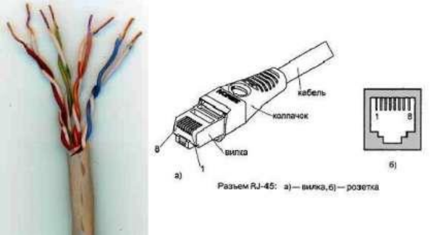
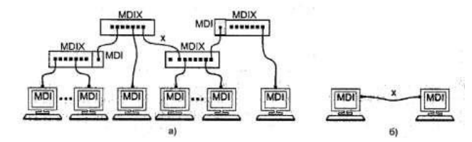
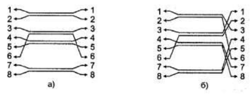
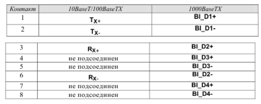
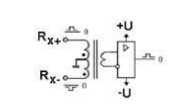
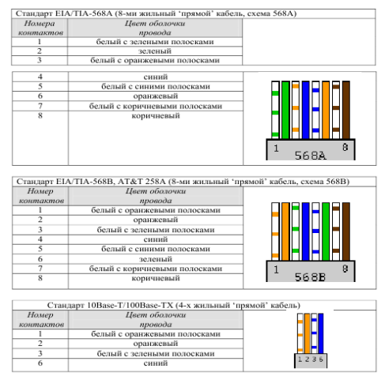
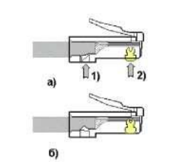
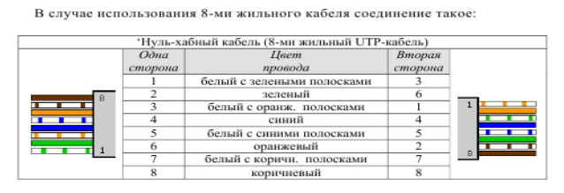

# Лабораторная работа № 1 «Подключение персонального компьютера к локальной вычислительной сети»
# Цель работы: приобретение практических знаний и навыков в выборе и установке сетевых адаптеров, монтажу и разделке сетевого кабеля, физическому присоединению ЭВМ к кабельной системе при создании локальной компьютерной сети по технологии Ethernet.
# Материалы, оборудование, программное обеспечение: IBM PCсовместимый персональный компьютер, сетевая карта (для шины данных PCI)производительностью 10-100 Mbit/сек с разъемом RJ-45, кабель UTP категории 5, вилки RJ-45, обжимной инструмент.
# Критерии положительной оценки: выполнение типового задания, оформление отчета по работе, ответы на вопросы для самопроверки.
# Теоретическое введение
## Сетевой стандарт Ethernet был разработан в 1975-х гг. в исследовательском центре корпорации Xerox
после чего доработан
совместно DEC, Intel и XEROX (отсюда сокращение DIX) и впервые
опубликован как 'Blue Book Standart' для Ethernet I в 1980 г. Этот стандарт
получил дальнейшее развитие и в 1985 г. вышел новый - Ethernet II (известный также как DIX).
## На основе стандарта Ethernet DIX был разработан стандарт IEEE 802.3, одобренный в 1985 г. для стандартизации комитетом по LAN IEEE (Institute of Electrical and Electronics Engineers).
В зависимости от вида физической среды
передачи данных стандарт IEEE 802.3 имеет модификации (число 10 в начале
каждой обозначает скорость передачи данных 10 Мбит/сек):
- 10Base-5 (применяется коаксиальный кабель диаметром 0,5 дюйма – так
называемый толстый коаксиал с волновым сопротивлением 50 ом;
максимальная длина сегмента сети без повторителей 500 м, считается
бесперспективным).
- 10Base-2 (коаксиальный кабель диаметром 0,25 дюйма - так
называемый тонкий коаксиал, волновое сопротивление 50 ом; максимальная
длина сегмента сети без повторителей 185 м, считается бесперспективным).
- 10Base-T (кабель на основе неэкранированной витой пары - UTP, Un
shielded Twisted Pair; физическая топология - звезда с концентратором в
центре, максимальное расстояние между концентратором и конечным
узлом - до 100 м).
- 10Base-F (волоконно-оптический кабель, топология сети аналогична
10BaseT; варианты: FOIRL допускает расстояние до 1000 м, 10Base-FL и
10Base-FB - до 2000 м).
## В 1995 г. принят стандарт Fast Ethernet (IEEE 802.3u), в 1998 г. - Gigabit Ethernet (IEEE 802.3z), в 2002 г. - 10 Gigabit Ethernet (IEEE 802.3ae).  
Ethernet и Fast Ethernet применяют один и тот же метод разделения
среды передачи данных CSMA/CD (Carrier Sense Multiple Access with
Collision Detection, метод коллективного доступа с опознаванием несущей и
обнаружением коллизий).
## Кабель UTP является наиболее дешевым (при обеспечении достаточной скорости передачи данных и простоте монтажа).
UTP-кабели категории 1
применяются в основном для телефонной разводки,  
UTP категории 3 служат
для передачи как голоса, так и данных при невысокой производительности (диапазон частот до 16 MHz).  
Для высокоскоростных протоколов при
передаче на большие расстояния могут применяться (более дорогие) кабели.  
UTP категорий 6 и 7 (экран вокруг каждой пары и вокруг всех жил соответственно, рабочие частоты до 300 и 600 MHz).
## В настоящее время при создании локальных компьютерных сетей практически всегда (для технологий Ethernet, Fast Ethernet и Gigabit Ethernet)
### Применяют кабель UTP категории 5 (8 попарно скрученных медных жил, активное сопротивление не более 9,4 ом на 100 м, полное волновое сопротивление 100 ом на частоте 100-120 MHz, затухание сигнала 0,8-22 дБ на частотах от 64 kHz до 100 MHz).
Каждый провод кабеля UTP маркирован
цветом (синий и белый с синими полосками, оранжевый и белый с
оранжевыми полосками, зеленый и белый с зелеными полосками,
коричневый и белый с коричневыми полосками по скрученным парам
соответственно), для UTP-кабеля применяются разъемы RJ-45 (рис. 1.1)

  
Рис. 1.1. Кабель UTP категории 5 (слева) и разъем RJ-45, показаны вилка
(plug) и розетка (jack)

## Отрезок UTP-кабеля (обычно не более 5 м) со смонтированными на его
концах вилками RJ-45 называют Patch cord'ом. Вилки RJ-45 являются неразборными, при необходимости кабель просто отрезают около вилки и
монтируют новую.
### Для технологии Ethernet 
используется топология 'звезда' с концентратором в центре, причем определены порты типа MDI (Medium Depended Interface, разъем сетевого адаптера) и MDIX (MDI crossing, разъем портов сетевого концентратора), рис. 1.2.  
### При соединении MDI-MDIX (подключение конечных узлов сети к
портам активного оборудования) используется 'прямой' кабель (рис. 1.3a),
### При соединении MDI-MDI 
(непосредственное соединение адаптеров компьютеров, рис. 1.2б) или  MDIX-MDIX (соединение двух коммуникационных устройств) используют 'перекрестный' (кроссовый) кабель (рис. 1.3б, причем на рис. 1.2 'перекрестный' кабель обозначен символом x).  
  
Рис. 1.2. Сеть 10BaseT/1 00BaseTX:
a) - звезда,  
б) - непосредственное соединение двух компьютеров (двухточечное соединение)  
Большинство современных коммутаторов используют функцию
автоопределения типа кабеля (MDI или MDIX), что почти исключает
вероятность ошибочного подсоединения.
#
  
Рис. 1.3. Интерфейсные кабели Ethernet:  
a) - 'прямой',  
б) - 'перекрестный' (кроссовый)
### В 10- и 100-мегабитном Ethernet'е (10BaseT/100BaseTX)
названия контактов содержат символы TX (transmitter, передатчик), RX (receiver, приемник) со знаками '+' и '—'  
и из 8 жил используется только половина (рис.8 1.3); для Gigabit Ethernet(1000BaseTX) используются все 8 медных жил (обмен данными по 4 парам жил в обоих направлениях одновременно),  
подсоединение соответствует табл. 1.1.
### Таблица 1.1. Разъем RJ-45 адаптера Ethernet
  
Сигналы по каждой двухпроводной линии передаются
дифференциальным способом (с противоположной полярностью по линиям
'+' и '-'),  
причем входные и выходные цепи сетевых адаптеров имеют
гальваническую развязку (рис.1.4).  
  
Рис. 1.4. Гальваническая развязка  

  
### Рис.1.6. Варианты заделки проводов
После описанного расположения жил на плоскости следует повернуть
вилку контактами к себе и аккуратно надвинуть на кабель до упора, чтобы провода прошли под контактами. 
### Последним действием является обжим вилки.
- На обжимном инструменте имеется специальное гнездо, в которое вставляется вилка с проводами, после чего нажатием на ручки инструмента вилка обжимается (рис. 1.7a) справа).  
- При этом контакты (на рис. показаны желтым цветом)
будут утоплены внутрь корпуса, прорежут изоляцию проводов и беспечат
надежный контакт жил кабеля с контактами вилки.  
- Фиксатор провода также должен быть утоплен в корпус (нажатие по cтрелке 1 на рис.1.7.)  
   
Рис. 1.7. Порядок обжима вилки
### В крайнем случае (если нет обжимного инструмента) можно обжать разъем RJ-45 тонкой отверткой (рис. слева).  
При этом следует утопить все 8 шт. контактов (1) в корпус, а затем утопить и фиксатор провода (3).  
Полезно подложите что-либо под разъем, чтобы не сломать его фиксатор (2).  
Это не есть самый надежный способ монтажа, но приемлемый.\

## Для непосредственного соединения двух компьютеров можно рекомендовать показанное ниже соединение ('перекрестный' кабель), приведен вариант 4-жильного так называемого 'нуль-модемного кабеля'.  
  