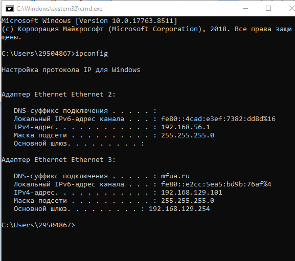
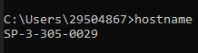
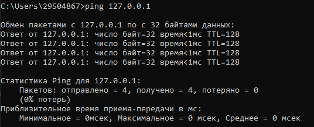
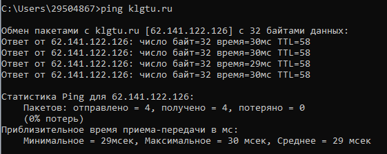
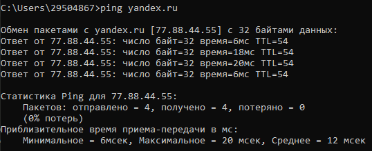
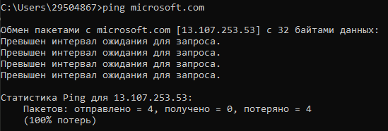
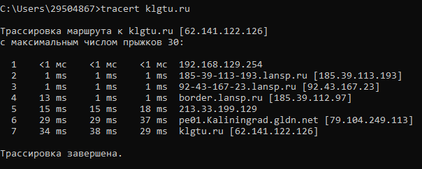
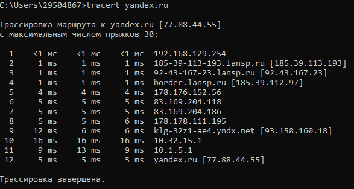
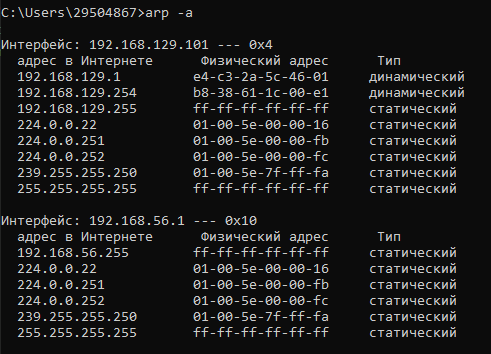

# Лабораторная работа № 2 «Изучение программных средств тестирования и определения параметров настройки в компьютерных сетях»
## Цель работы: 
приобретение знаний и практических навыков в использовании программного обеспечения для настройки и тестирования компьютерной сети.
#
## Материалы, оборудование, программное обеспечение:
лаборатория, оснащенная персональными компьютерами, объединенными в локальную сеть с доступом в Интернет, утилиты сканирования беспроводных сетей.
# Теоретическое введение
### Для тестирования параметров (маршрут и скорость передачи данных) соединения с глобальной сетью Интернет, а также проверки правильности сетевых настроек имеется большое количество программных средств.
Например, в операционной системе MS Windows
– это встроенные компьютерные программы – утилиты, которые
позволяют оценить надежность соединения и ряд других важных
параметров.
#
# Задания к лабораторной работе
## Задание 1
Определить IP-адрес локального (своего) компьютера,
подключенного к сети.  
Для запуска данной программы необходимо выполнить
команду **ipconfig** в режиме командной строки.  
При выполнении данной команды на экране монитора компьютера будет выведена основная
конфигурация **TCP/IP** для всех сетевых адаптеров (см. рис. 2.1).
### Настройки протокола IP для операционной системы Windows:

#
## Задание 2
Определить имя узла компьютера в локальной сети.  
Для определения имени узла компьютера в локальной сети необходимо
использовать утилиту **HOSTNAME**.  
После выполнения команды **hostname** в
режиме командной строки на экран монитора выводится информация об
имени узла компьютера в локальной сети.
### Имя узла компьютера в локальной сети:
 
#
## Задание 3
Если в командной строке ввести команду **ping 127.0.0.1** (127.0.0.1 — IP-адрес специального 26 сетевого интерфейса в сетевом протоколе TCP/IP и обозначает, то же самое сетевое устройство.
### Тест на корректность работы утилиты:
 
#
### Для проверки наличия связи с узлом KLGTU.RU введем команду: 
**ping klgtu.ru**
Тест проверки связи с узлом KLGTU.RU:
 
#
### Тест проверки связи с узлом YANDEX.RU:
 
#
### Тест проверки связи с узлом MICROSOFT.COM:
 
#
## Задание 4
Определить маршрут пакетов до заданного узла и получить временные
характеристики для каждого промежуточного маршрутизатора на этом пути.  
Для трассировки маршрута до узла KLGTU.RU выполним команду **tracert klgtu.ru**:  
 
Для трассировки маршрута до узла YANDEX.RU выполним команду **tracert yandex.ru**:  

# 
## Задание 5
Определить соответствие локального IP-адреса, физическому (аппаратному) адресу в локальной сети.  
Утилита **ARP** с ключом -a позволяет
вывести на экран всю ARP-таблицу. Выполним команду **arp -a**.
 
#

